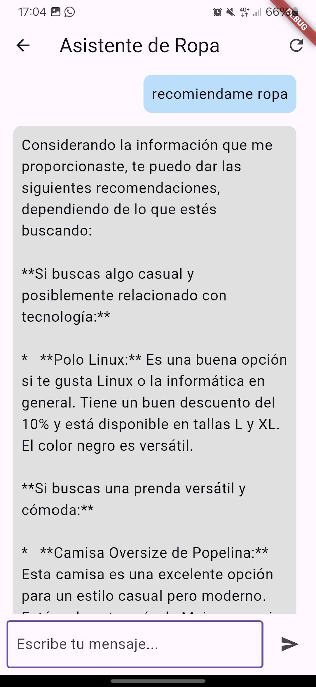
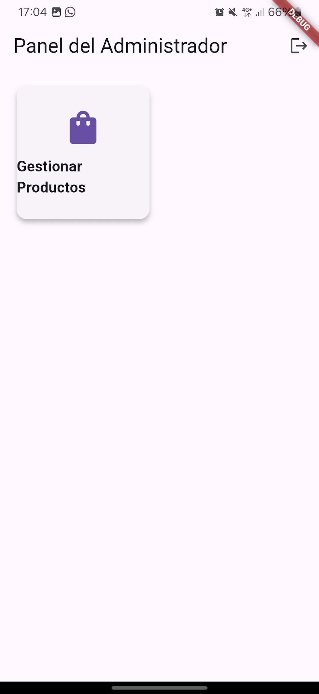
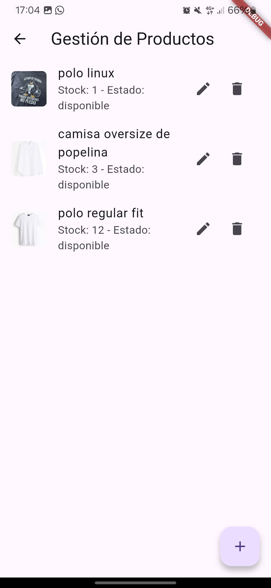
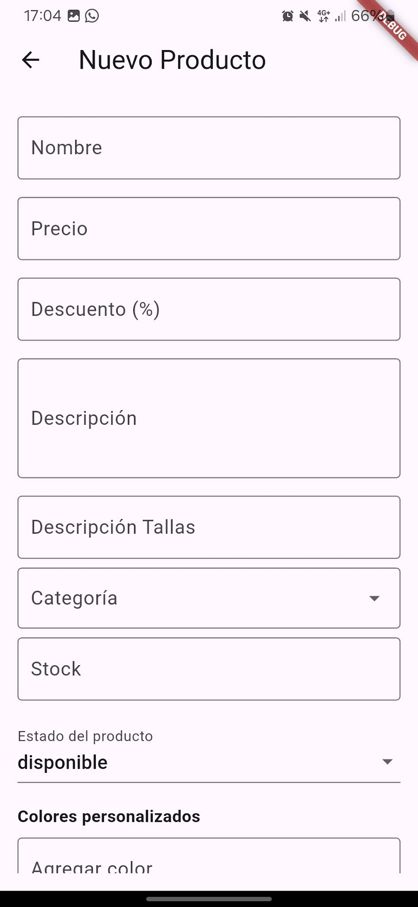
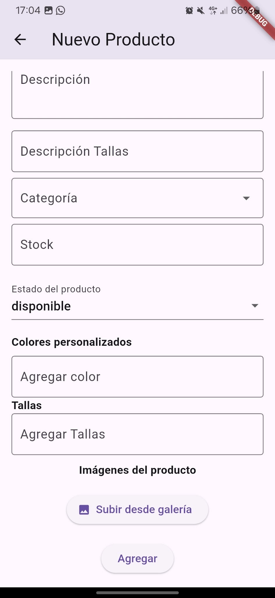
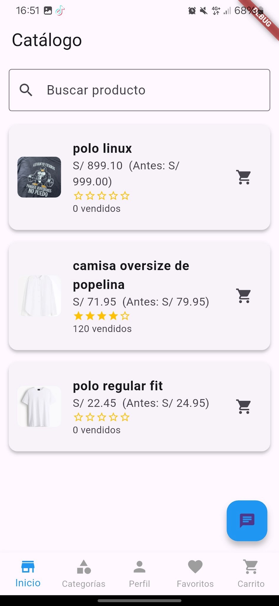

# E-commerce App - Examen Práctico SM2

## Descripción del Proyecto

Esta es una aplicación móvil de comercio electrónico desarrollada con Flutter. Permite a los usuarios visualizar productos, obtener recomendaciones desde un chatbot y al administrador gestionar el inventario desde un panel privado.

---

## Funcionalidades Implementadas

### HU-01: Consultar recomendaciones a través del chatbot
- El usuario puede escribir mensajes como "recomiéndame ropa" y el sistema responde automáticamente con sugerencias personalizadas.
- Las recomendaciones están vinculadas al catálogo y se generan mediante inteligencia artificial (Dialogflow y Gemini API).

### HU-02: Administrar productos en la tienda (rol administrador)
- El administrador puede:
  - Agregar nuevos productos (con imagen, precio, descuento, tallas, colores, stock y estado).
  - Editar o eliminar productos existentes.
  - Ver una lista de productos en la tienda con stock y estado.

---

## Tecnologías y Herramientas

- Flutter 3.24.3
- Firebase Firestore
- Firebase Storage
- Dialogflow + dialogflow_flutter
- Google Gemini API
- Image Picker
- flutter_dotenv
- Visual Studio Code / Android Studio

---

## Capturas de Pantalla

### Chatbot con Recomendaciones

### Panel del Administrador

### Lista de Productos

### Registro de Nuevo Producto

### Catálogo General

---

## Pasos para Ejecutar el Proyecto

1. Clonar el repositorio
git clone https://github.com/usuario/SM2_EXAMEN_PRACTICO.git
cd SM2_EXAMEN_PRACTICO

2. Verficiar que todo este ok
flutter doctor

3. Instalar dependencias
flutter pub get

4. Ejecutar la aplicación
flutter run

